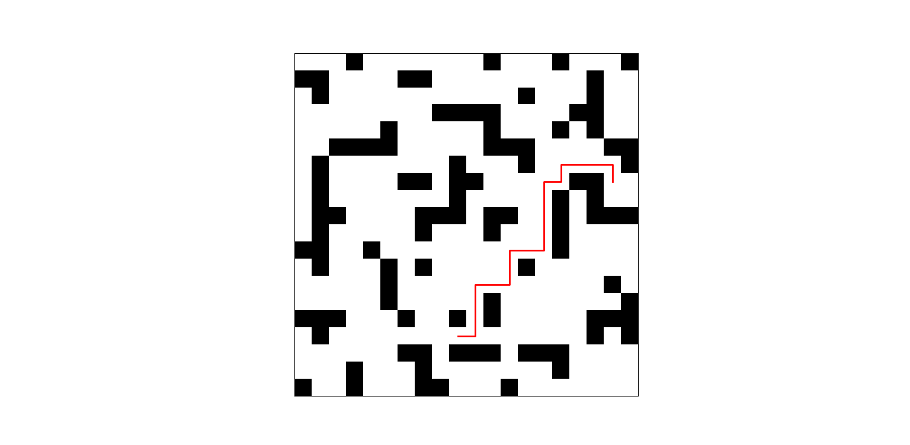

# Pathfinding Playground

Pathfinding Playground is a small Python project I’m using to experiment with pathfinding and learn more about how different algorithms work.

Right now it includes an A* algorithm and some tests using Perlin noise maps to create more varied terrain. I built the A* implementation myself so I could understand the logic behind it rather than just use an existing library.

I’m planning to keep adding more features over time, including other pathfinding algorithms, visualisation, and different types of generated maps.

## Examples

  

This is an example of perlin noise being used to generate a map to solve